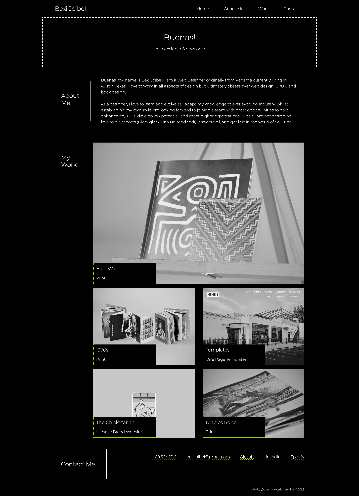

# Developer Portfolio

## Overview

This is the home page of my developer Portfolio. This layout will serve as a foundation for the remainder of the portfolio.

### User Experience

The user is able to use this one page website to review my work and learn more about me as as designers and developer. Since it is a one page website at the moment the work section is in progress and placeholder. 

Each link will take the user down to each section of the webpage where they can access the about me, my work, and contact sections. In the contact section, the user will be able to visit links where they can contact me. 

I have customized the original design of the mockup to meet my branding and aesthetic.

## Link 

https://thechicketarian.github.io/Porfolio-3-26/

## MockUp

# 
